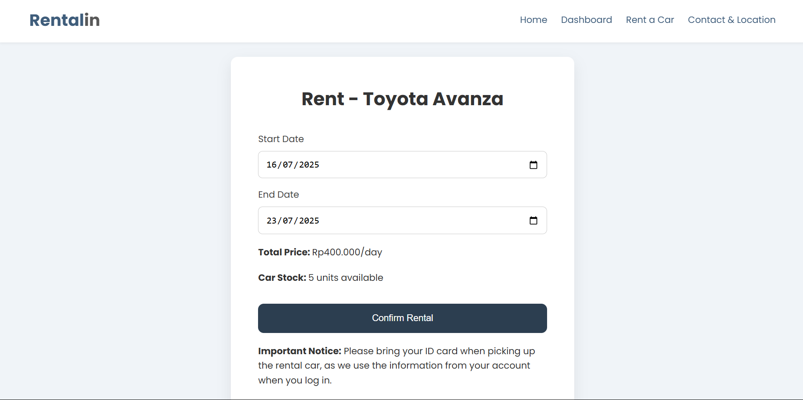
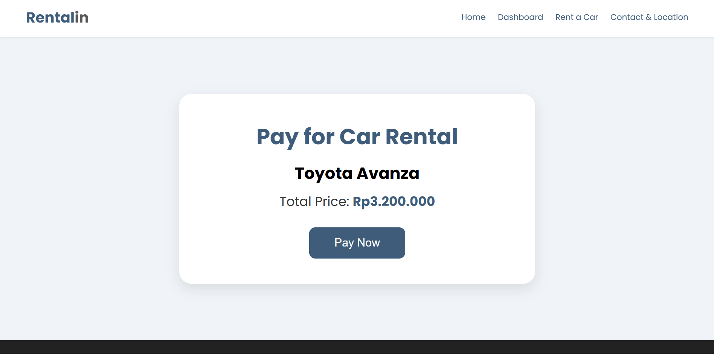
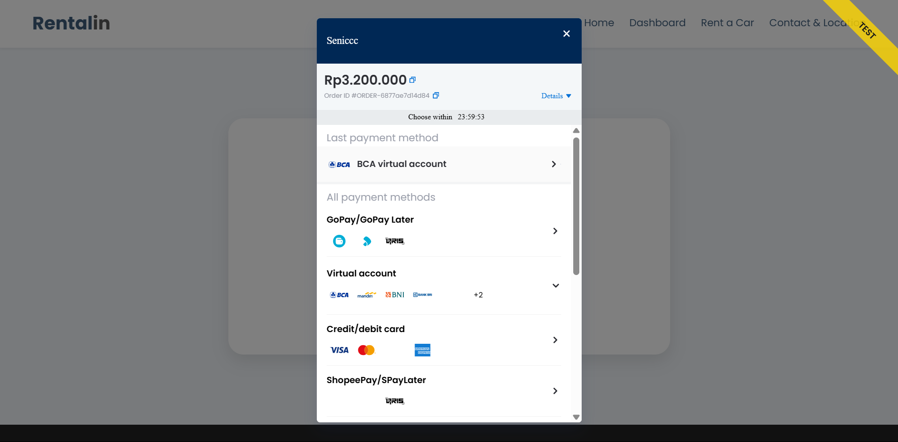
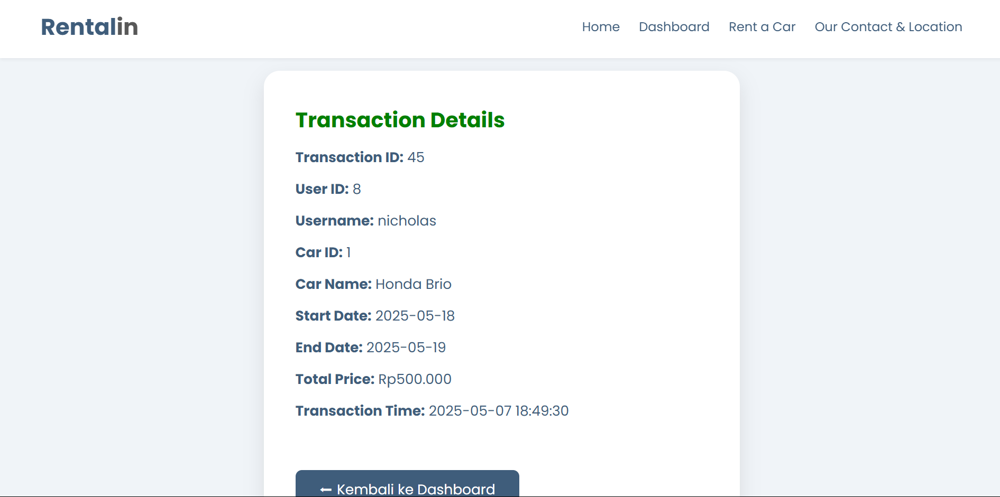
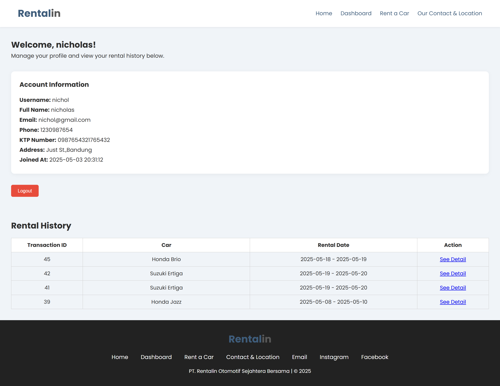
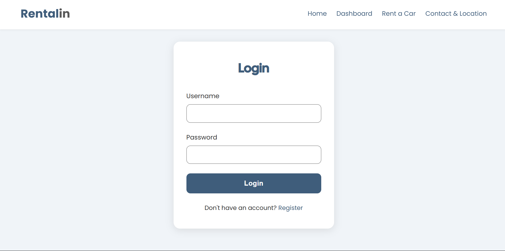
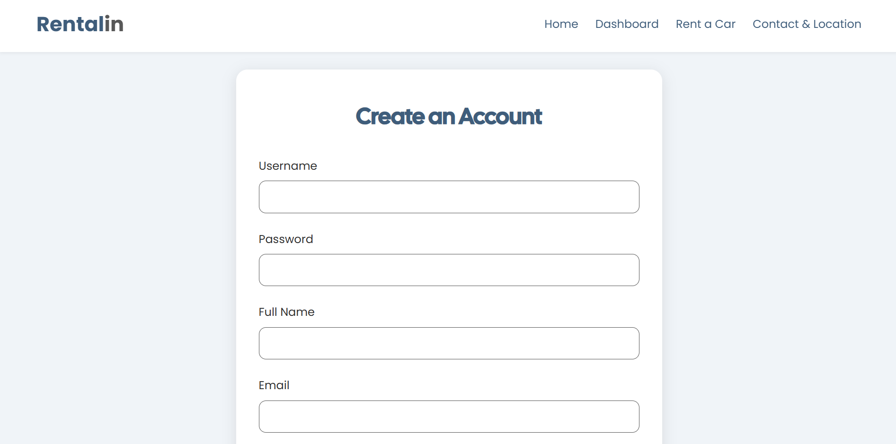

# Rentalin - Car Rental Website 🚗

**Rentalin** is a simple web-based car rental application built using native HTML, CSS, JavaScript, and PHP. The system allows users to register, log in, view available cars, select rental dates, and complete payments securely through Midtrans.

---

## 🌐 Live Demo

👉 [https://rentalin.ct.ws](https://rentalin.ct.ws)

---

## 📸 Screenshots

### 🏠 Homepage
Landing page for the Rentalin website.

### 🚘 Available Cars
List of available cars for rent.

### 📅 Select Rent Dates
Form for selecting rental start and end dates.

### 💳 Confirm Payment
Final confirmation before redirecting to payment.

### 💸 Midtrans Payment
Payment interface using Midtrans Snap API.

### ✅ Transaction Success
Displays transaction details after successful payment.

### 🧑‍💼 Dashboard
User dashboard showing profile and rental history.

### 🔐 Login
Login form for registered users.

### 📝 Register
New user registration form.

---

## 🛠️ Features

- ✅ User registration & login
- ✅ Car browsing and rental date selection
- ✅ Booking confirmation
- ✅ Midtrans Snap payment integration
- ✅ Dashboard with rental history
- ✅ Transaction summary

---

## 🧰 Tech Stack

- **Frontend:** HTML, CSS, JavaScript (Native)
- **Backend:** PHP (Native)
- **Database:** MySQL
- **Payment Gateway:** Midtrans Snap (manual integration)

---

## 👤 Author

**Nicholas Jeremy**  
🔗 [GitHub - Senicccc](https://github.com/Senicccc)

